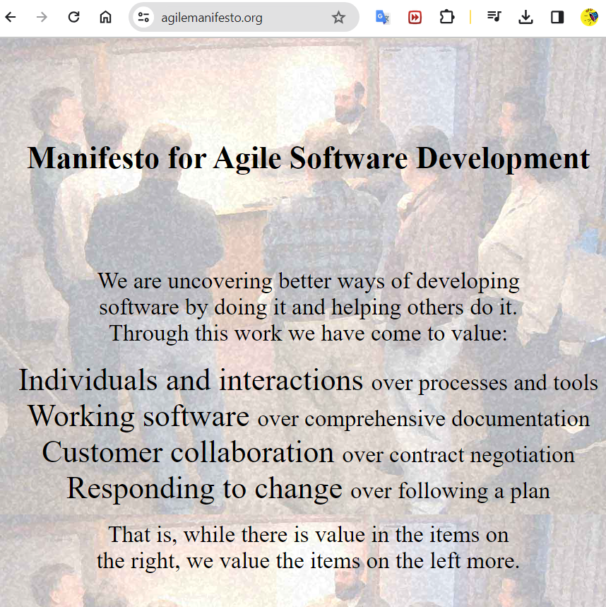

**Mechanism to optimize the value delivery system**

Scrum is used to drive the work, the effort we take to deliver value in complex environments (get an agreement a lot peple).

Scrum is a mechanism to guide changes effectiveness (what) and efficiency.(how).

Scrum as a **continuous** adaptation cycle= "guiding changes."

Scrum is a **framework** that you can use as a foundation to work on complex problems.

Scrum is a strategy; the what backed by the whys.

### Why do we need to define how to adopt Scrum?

Because each product, organizational culture, technology,

and so on are different.

# Traditional Vs Agile
The **waterfall** o  traditional method is proactive, predictive, plan-driven, and disciplined.  => Develop the perfect plan and then follow it acording to specific VISION. what, when y for how much.

Waterfall can lead you to a useless product, if there is a change in the target/vision, there is lots of uncertainty regarding what to build and how to build it.

The implementation of changes might not be enough to deliver the correct vision or something sufficiently close to it. And we might at some point get to the correct vision, but it will be so late that it might be useless.

In **Agile**, we cannot come up with a perfect plan. The idea is to deliver something close to the customer's needs in short cycles, given what we know now and learn with experience.

After experiencing the result, the customers, stakeholders, and the team become more informed and make a better decision about the product, which might be adjusting our product vision.


Problem when the product is intagile or innovative and the users just know if the product is valuable when they see it.

After they have analyzed or inspected our deliverable, we get feedback from them and learn more about what needs to be delivered.This might cause us to adapt our vision and  our plan.

We deliver a new version, get our customers to use it, analyze the feedback and adjust again; hopefully getting closer and closer to the correct vision.

## what is agility?

Agility, or being agile, means responding to change.


## about Scrum?

Scrum is a mechanism to guide changes.

Scrum is an Agile framework.

Agile is best suited for complex environments, where changes are natural and should not be avoided because adapting is the way to lead us to the desired outcomes, in other words, the correct product vision.

This scenario is frequent for developing innovative or complex products.

Succeding with Agile and Scrum requires being rapid (fast) and lean (no waste)

## Agile manifesto 
[](https://agilemanifesto.org/)


### Mindset 
=> uncovere => we don't assume we know how to solve a problem.
```shell
1. set back -> learning opportunities
2. Adap short delivery cycles, collaboration, and change.
3. Focus on delivering value.
```
### Values
```shell
1. individual and interactions OVER processes and tools => share knowlodge to solve the complex and get the best solution.
2. working software OVER comprehensive documentation =>something to see or touch
3. Customer collaboration OVER contract negotiation.
4. Responding to change OVER following a plan.
```
### Principles
1. Projects
2. Product
3. People
4. Process

Scrum is a lightweight framework that helps people, teams and organizations generate value through adaptive solutions for complex problems.

In a nutshell, Scrum requires a Scrum Master to foster an environment where:

A Product Owner orders the work for a complex problem into a Product Backlog.

The Scrum Team turns a selection of the work into an Increment of value during a Sprint.

The Scrum Team and its stakeholders inspect the results and adjust for the next Sprint.

Repeat

Scrum is simple. Try it as is and determine if its philosophy, theory, and structure help to achieve goals and create value. The Scrum framework is purposefully incomplete, only defining the parts required to implement Scrum theory. Scrum is built upon by the collective intelligence of the people using it. Rather than provide people with detailed instructions, the rules of Scrum guide their relationships and interactions.

Various processes, techniques and methods can be employed within the framework. Scrum wraps around existing practices or renders them unnecessary. Scrum makes visible the relative efficacy of current management, environment, and work techniques, so that improvements can be made.